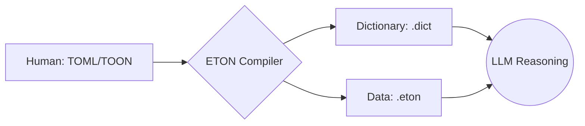

# ETON: Efficient Token-Oriented Notation

> **"The Protocol for Intelligence."**

ETON は、**LLM（大規模言語モデル）との通信効率を極限まで高めるために設計された、ステートフルなデータプロトコル**です。
人間が管理する「意味 (TOML/TOON)」と、通信のための「表現 (ETON)」を明確に分離し、圧倒的なトークン削減を実現します。

## 📁 プロジェクト構成

## 📦 インストール

```bash
pnpm install
```

## 🛠 基本的な使い方 (Object -> ETON)

```typescript
import { encodeBatch, createState } from './src/encoder';

const data = [{ id: 1, name: "Alice", role: "Admin" }];
const schemas = { "User": ["id", "name", "role"] };
let state = createState();

const [encoded, newState] = encodeBatch(data, "User", schemas, state);
console.log(encoded);
// 出力例: @1,@2,@3
```

## 🛠 ストリーミング (Encoder Stream)

```typescript
import { EtonEncoderStream } from './src/stream';

const encoder = new EtonEncoderStream("User", { "User": ["id", "name", "role"] });
const writer = encoder.writable.getWriter();

writer.write({ id: 1, name: "Alice", role: "Admin" });
```

## 🏗 アーキテクチャ

ETON は **「意味」と「データ」を分離** します。



- **Dictionary**: 頻出文字列の実体を管理。
- **Data**: シンボル化された軽量なレコード行。

これにより、LLM に対しては「辞書を一度システムプロンプト等で与えれば、以降は極小のトークンでデータを送信し続ける」という運用が可能になります。

## 📊 ドキュメント (Documents)

### 🌐 公開用 (Public)
- **[技術仕様書](./docs/ETON_Specification.md)**: フォーマットの定義、規則、データ型。
- **[ETON 形式サンプル](./docs/ETON_Sample.md)**: 実際のデータ記述例。
- **[フォーマット比較](./docs/Format_Comparison.md)**: JSON/TOON との使い分け。

### 🧠 開発・内部資料
*詳細な設計思想、ベンチマークデータ、戦略については内部ドキュメントを参照してください。*

---

## ⚠️ 開発ステータスと警告

> [!WARNING]
> ETONは現在 **Alpha** 段階です。
> トークン節約効率については実証済みですが、LLM による解釈精度の統計的保証はまだありません。
> 重要なプロジェクトに導入する際は、必ず自身のデータセットでスモークテストを実施してください。

---

## ✨ コア・バリュー

1.  **Extreme Efficiency**: JSON 比 **~66%** のトークン削減。
2.  **Stateful Optimization**: 共通の辞書を再利用することで、繰り返し通信のコストを最小化。
3.  **Auditability**: `!AUDIT` 行による整合性チェック機能を標準装備。

---
License: MIT
