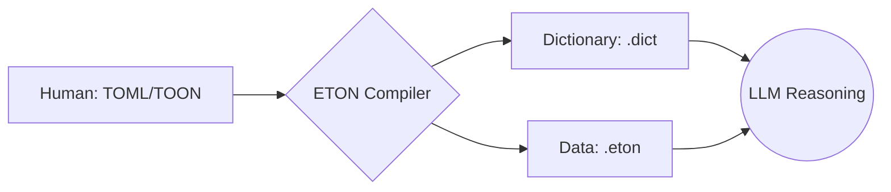

# ETON: Efficient Token-Oriented Notation

> **"The Protocol for Intelligence."**

ETON は、**LLM（大規模言語モデル）との通信効率を極限まで高めるために設計された、ステートフルなデータプロトコル**です。
人間が管理する「意味 (TOML/TOON)」と、通信のための「表現 (ETON)」を明確に分離し、圧倒的なトークン削減を実現します。

## なぜ ETON なのか？

LLMとの大量通信において、トークン数は**コストそのもの**です。

### ベンチマーク (vs Minified JSON)
| データ種別 | JSON (Baseline) | Pure ETON (CSV) | **Hybrid ETON (JSON)** | ETON削減率 |
| :--- | :--- | :--- | :--- | :--- |
| **Tabular** (List of Objects) | ~3,900 tokens | **~2,400 tokens** | ~3,500 tokens | **-37%** (Pure) |
| **Nested** (Complex Graph) | ~6,700 tokens | ~7,100 tokens | **~4,400 tokens** | **-35%** (Hybrid) |
| **Large Logs** (Repetitive) | ~127,700 tokens | ~153,000 tokens | **~84,400 tokens** | **-33%** (Hybrid) |
| **High Redundancy** | ~2,300 tokens | **~1,500 tokens** | ~2,100 tokens | **-35%** (Pure) |

*   **Pure ETON**: フラットな構造（Tabular）や非常に冗長性の高いデータで最強の効率を発揮。
*   **Hybrid ETON**: 複雑なネスト構造や大規模ログデータにおいて、安定して JSON を凌駕。
*   **TOON**: 可読性重視のため、Minified JSON と比較するとサイズは大きくなりますが、人間にとっての理解しやすさは維持されます。

> **Note:** データ構造に応じて `Pure` (CSV辞書) と `Hybrid` (JSON辞書) を使い分けることで、あらゆるシナリオで最適化が可能です。

[詳細なベンチマークレポート](./docs/Benchmark_Report.md)

ETONは「辞書を一度渡せば、以降は極小のトークンで済む」ステートフルな設計により、RAGパイプラインやマルチエージェント通信で真価を発揮します。

---

## アーキテクチャ: Bridge & Compiler

ETON は単なるデータ形式ではなく、LLM 通信のための **「コンパイル型プロトコル」** です。



1.  **Source (TOML/TOON)**: 人間が編集・管理するマスターデータ。
2.  **Bridge / Compiler**: ソースを解析し、「辞書 (Dictionary)」と「データ本体 (ETON)」に分離。
3.  **Protocol (ETON)**: LLM への入力専用。極小トークンで高密度な情報を転送。

---

## インストール

```bash
pnpm install
```

## 基本的な使い方 (Object -> ETON)

```typescript
import { encodeBatch, createState } from './src/encoder';

const data = [{ id: 1, name: "Alice", role: "Admin" }];
const schemas = { "User": ["id", "name", "role"] };
let state = createState();

const [encoded, newState] = encodeBatch(data, "User", schemas, state);
console.log(encoded);
// 出力:
// %User
// 1,@1,@2
```

## ストリーミング (Encoder Stream)

```typescript
import { EtonEncoderStream } from './src/stream';

const encoder = new EtonEncoderStream("User", { "User": ["id", "name", "role"] });
const writer = encoder.writable.getWriter();

writer.write({ id: 1, name: "Alice", role: "Admin" });
// ストリームから %Schema, %Symbol, %Data, そしてデータ行が順次出力されます
```

---

## ドキュメント (Documents)

### 主要ドキュメント

#### [1. 技術仕様書 (Specification)](./docs/ETON_Specification.md)
ETON フォーマットの**公式な定義**と**プロトコル仕様**です。
- データ構造（Schema, Symbol, Data, Audit）の詳細定義
- 型システムとエンコーディングルール
- ストリーミング通信の仕様

#### [2. データ記述サンプル (Sample)](./docs/ETON_Sample.md)
実際の ETON 形式の**具体例**を示します。
- ユーザープロファイル、注文情報などのユースケース別の記述例
- スキーマ定義とデータ行の対応関係

#### [3. フォーマット比較 (Comparison)](./docs/Format_Comparison.md)
JSON や TOON との**特性比較**と**使い分け**のガイドラインです。
- トークン効率、可読性、設計思想の比較表
- 「なぜ ETON を使うのか？」の技術的根拠

#### [4. 自動辞書判別機能 (Auto-Detect)](./docs/Feature_Auto_Detection.md)
データの内容に応じて、最適な辞書形式（CSV/JSON）を自動選択する機能について解説します。

---

## 使うべき場面・使うべきでない場面

### ETONが最適
- [x] 高スループットなエージェントシステム
- [x] RAGパイプライン
- [x] ログ圧縮

### ETONは不適切
- [ ] ワンショットAPIコール
- [ ] 人間が編集する設定ファイル
- [ ] 小規模データセット

---

## FAQ

**Q: LLMの解釈精度は？**  
A: GPT-5, Kimi 2.5, Haiku 4.5等での単回テストでは解釈可能であることを確認していますが、統計的保証はまだありません。本番投入前に必ずスモークテストを実施してください。

**Q: なぜ辞書が必要？**  
A: "Admin"を100回送るより、辞書で一度`@2="Admin"`と定義し、以降は`@2`と送る方が圧倒的に安価だからです。

**Q: 本番で使える？**  
A: 現在は Alpha 版です。小規模で試して、問題なければ段階的に拡大してください。

---

## 開発ステータス

> [!WARNING]
> ETON は現在 **Alpha** 段階です。
>
> - トークン削減効果は実証済み（**66%削減**）
> - LLMの解釈精度は統計的に広範な検証がされていません
> - 重要なプロジェクトでは、必ず自分のデータでテストしてください

---

## Contributing

ETONは研究プロジェクトです。改善提案歓迎！

**開発優先度:**
- [ ] エラーハンドリング強化
- [ ] パフォーマンス最適化（大規模データ）
- [ ] エッジケーステストの拡充

---
License: MIT