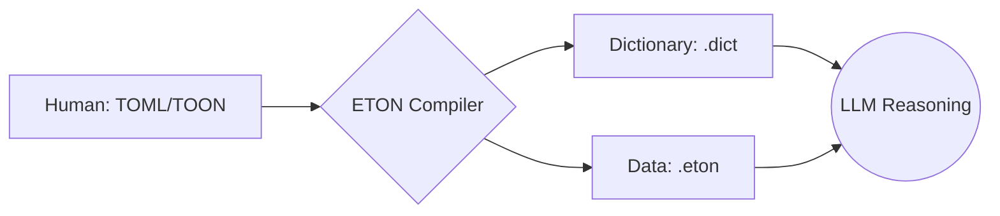

# ETON: Efficient Token-Oriented Notation

> **"Is Stateless JSON really the final answer for AI communication?"**

ETON (Efficient Token-Oriented Notation) is an **experimental stateful data protocol designed to maximize the "Cognitive Throughput" of Large Language Models (LLMs)**.
We propose a solution to the biggest bottleneck in current AI communication—**"Token Explosion"**—by clearly separating the "Meaning (TOML/TOON)" managed by humans from the "Representation (ETON)" processed by machines.

## The Problem: Token Explosion

Modern AI systems continuously re-transmit vast amounts of "context (dictionary information)" with every interaction.
This is as inefficient as **"reading the entire dictionary aloud at the start of every phone call."**
ETON solves this waste through **"Statefulness"**.

## Competitive Analysis

Why do we need a new format? Here is ETON's positioning compared to existing technologies.

| Feature | **ETON** (Proposed) | JSON (Standard) | Protobuf / MsgPack | TOON (Human) |
| :--- | :--- | :--- | :--- | :--- |
| **Primary Goal** | **Token Efficiency for LLM** | Data Interchange | Binary Size / Speed | Human Readability |
| **Format** | Text (CSV/JSON Hybrid) | Text | Binary | Text (YAML-like) |
| **LLM Readable?** | ✅ (Designed for it) | ✅ (Native) | ❌ (Need decoding) | ✅ (Excellent) |
| **Stateful?** | **Yes** (Dictionary) | No | No | No |
| **Compression** | **High** (Symbolized) | Low | High | Low |

*   **vs JSON**: JSON is too verbose. ETON eliminates "key repetition" through dictionary separation.
*   **vs Protobuf**: Binary formats are difficult for LLMs to understand directly (via tokenizer). ETON is **text-based**, allowing LLMs to "read and write" it directly.
*   **vs TOON**: TOON is a format for "humans to write". ETON is the compiled result for "machines to read".

---

## Why ETON?

In massive communication with LLMs, token count is **cost itself**.

### Benchmarks (vs Minified JSON)

| Data Type | JSON (Baseline) | Pure ETON (CSV) | **Hybrid ETON (JSON)** | ETON Reduction |
| :--- | :--- | :--- | :--- | :--- |
| **Tabular** (List of Objects) | ~3,900 tokens | **~2,400 tokens** | ~3,500 tokens | **-37%** (Pure) |
| **Nested** (Complex Graph) | ~6,700 tokens | ~7,100 tokens | **~4,400 tokens** | **-35%** (Hybrid) |
| **Large Logs** (Repetitive) | ~127,700 tokens | ~153,000 tokens | **~84,400 tokens** | **-33%** (Hybrid) |
| **High Redundancy** | ~2,300 tokens | **~1,500 tokens** | ~2,100 tokens | **-35%** (Pure) |

*   **Pure ETON**: Maximum efficiency for flat structures (Tabular) and highly redundant data.
*   **Hybrid ETON**: Consistently outperforms JSON for complex nested structures and large log data.
*   **TOON**: While larger than Minified JSON due to readability priority, it remains easily understandable for humans.

> **Note:** By choosing between `Pure` (CSV Dictionary) and `Hybrid` (JSON Dictionary) depending on the data structure, optimization is possible in all scenarios.

[Detailed Benchmark Report](./docs/Benchmark_Report.md)
*

ETON demonstrates its true value in RAG pipelines and multi-agent communication through its stateful design: "Once the dictionary is passed, subsequent tokens are minimal."

---

## Architecture: Bridge & Compiler

ETON is not just a data format, but a **"Compiled Protocol"** for LLM communication.



1.  **Source (TOML/TOON)**: Master data edited and managed by humans.
2.  **Bridge / Compiler**: Parses the source and separates it into "Dictionary" and "Data Body (ETON)".
3.  **Protocol (ETON)**: Exclusively for LLM input. Transfers high-density information with minimal tokens.

---

## Installation

Currently, this project is in the development phase. Please set it up from the source code.

```bash
# Clone the repository
git clone https://github.com/kida-hirokazu/eton.git
cd eton

# Install dependencies
pnpm install

# Build (if needed)
pnpm build
```

**Prerequisites:**
- Node.js 22+
- pnpm (recommended)

## Basic Usage (Object -> ETON)

```typescript
import { dumps } from './src/index';

const data = [{ id: 1, name: "Alice", role: "Admin" }];
const schemas = { "User": ["id", "name", "role"] };

// 'dumps' automatically selects the optimal format (CSV or JSON)
const eton = dumps(data, "User", schemas);

console.log(eton);
// Example Output:
// %User
// 1,@1,@2
// ... (Dictionary)
```

## Streaming (Encoder Stream)

```typescript
import { EtonEncoderStream } from './src/stream';

const encoder = new EtonEncoderStream("User", { "User": ["id", "name", "role"] });
const writer = encoder.writable.getWriter();

writer.write({ id: 1, name: "Alice", role: "Admin" });
// %Schema, %Symbol, %Data, and data rows are output sequentially from the stream
```

---

## Documents

### Main Documentation

#### [1. Technical Specification](./docs/ETON_Specification.md)
The **official definition** and **protocol specification** of the ETON format.
- Detailed definition of data structures (Schema, Symbol, Data, Audit)
- Type system and encoding rules
- Streaming communication specifications

#### [2. ETON Format Sample](./docs/ETON_Sample.md)
Provides **concrete examples** of actual ETON format data.
- Description examples by use case such as user profiles and order information
- Relationship between schema definitions and data rows

#### [3. Format Comparison](./docs/Format_Comparison.md)
Guidelines for **feature comparison** and **differentiation** from JSON and TOON.
- **Auto-Detection**: Automatically analyzes data structures and selects the optimal format ([Details](docs/Feature_Auto_Detection.md)).
- **Hybrid Dictionary**: Switches between CSV token efficiency and JSON expressiveness as needed.
- Comparison table of token efficiency, readability, and design philosophy
- Technical rationale for "Why use ETON?"

#### [4. Auto-Detect Dictionary Format](./docs/Feature_Auto_Detection.md)
Explains the feature that automatically selects the optimal dictionary format (CSV/JSON) based on data content.

---

## When to Use / When Not to Use

### Best for ETON
- [x] High-throughput Agent Systems
- [x] RAG Pipelines
- [x] Log Compression

### Not for ETON
- [ ] One-shot API Calls
- [ ] Configuration Files edited by Humans
- [ ] Small Datasets

---

## FAQ

**Q: How accurate is the LLM interpretation?**
A: Interpretation has been confirmed in single-shot tests with GPT-5, Kimi 2.5, Haiku 4.5, etc., but there is no statistical guarantee yet. Please assume smoke tests are necessary before production deployment.

**Q: Why is a dictionary necessary?**
A: Because it is overwhelmingly cheaper to define `@2="Admin"` once in the dictionary and send `@2` thereafter, rather than sending "Admin" 100 times.

**Q: Is it production-ready?**
A: It is currently in **Alpha**. Please try it on a small scale and expand gradually if there are no issues.

---

## Development Status

> [!WARNING]
> ETON is currently in **Alpha** stage.
>
> - Token reduction effect is proven (**66% reduction**)
> - LLM interpretation accuracy has not been statistically verified extensively
> - For critical projects, please be sure to test with your own data
