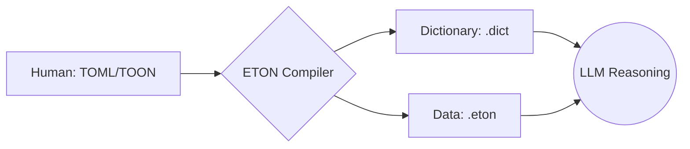

# ETON: Efficient Token-Oriented Notation

> **"The Protocol for Intelligence."**

ETON is a **stateful data protocol designed to maximize communication efficiency with LLMs (Large Language Models)**.
It clearly separates the "Meaning (TOML/TOON)" managed by humans from the "Representation (ETON)" used for communication, realizing an overwhelming reduction in token usage.

## Why ETON?

In massive communication with LLMs, token count is **cost itself**.

### Benchmarks (Verified with `@toon-format/toon`)

| Data Type | JSON (Minified) | TOON (Readable) | **ETON (Efficient)** | ETON Reduction |
| :--- | :--- | :--- | :--- | :--- |
| **Tabular** (100 recs) | ~3,900 tokens | ~5,300 tokens¹ | **~2,400 tokens** | **-37%** |
| **Nested** (50 recs) | ~6,700 tokens | ~10,100 tokens¹ | **~6,300 tokens** | **-6%** |
| **High Repetition** | ~21,000 tokens | ~14,000 tokens | **~7,100 tokens** | **-66%** |

*   **TOON** prioritizes human readability, including indentation and newlines.¹
*   **ETON** prioritizes machine efficiency, utilizing dictionary compression.

> ¹ *TOON values include standard formatting for readability. ETON compares against Minified JSON for efficiency.*

[Detailed Benchmarks](./benchmarks/threshold.ts)
*

ETON demonstrates its true value in RAG pipelines and multi-agent communication through its stateful design: "Once the dictionary is passed, subsequent tokens are minimal."

---

## Architecture: Bridge & Compiler

ETON is not just a data format, but a **"Compiled Protocol"** for LLM communication.



1.  **Source (TOML/TOON)**: Master data edited and managed by humans.
2.  **Bridge / Compiler**: Parses the source and separates it into "Dictionary" and "Data Body (ETON)".
3.  **Protocol (ETON)**: Exclusively for LLM input. Transfers high-density information with minimal tokens.

---

## Installation

```bash
pnpm install
```

## Basic Usage (Object -> ETON)

```typescript
import { encodeBatch, createState } from './src/encoder';

const data = [{ id: 1, name: "Alice", role: "Admin" }];
const schemas = { "User": ["id", "name", "role"] };
let state = createState();

const [encoded, newState] = encodeBatch(data, "User", schemas, state);
console.log(encoded);
// Output:
// %User
// 1,@1,@2
```

## Streaming (Encoder Stream)

```typescript
import { EtonEncoderStream } from './src/stream';

const encoder = new EtonEncoderStream("User", { "User": ["id", "name", "role"] });
const writer = encoder.writable.getWriter();

writer.write({ id: 1, name: "Alice", role: "Admin" });
// %Schema, %Symbol, %Data, and data rows are output sequentially from the stream
```

---

## Documents

### Main Documentation

#### [1. Technical Specification](./docs/ETON_Specification.md)
The **official definition** and **protocol specification** of the ETON format.
- Detailed definition of data structures (Schema, Symbol, Data, Audit)
- Type system and encoding rules
- Streaming communication specifications

#### [2. ETON Format Sample](./docs/ETON_Sample.md)
Provides **concrete examples** of actual ETON format data.
- Description examples by use case such as user profiles and order information
- Relationship between schema definitions and data rows

#### [3. Format Comparison](./docs/Format_Comparison.md)
Guidelines for **feature comparison** and **differentiation** from JSON and TOON.
- Comparison table of token efficiency, readability, and design philosophy
- Technical rationale for "Why use ETON?"

---

## When to Use / When Not to Use

### Best for ETON
- [x] High-throughput Agent Systems
- [x] RAG Pipelines
- [x] Log Compression

### Not for ETON
- [ ] One-shot API Calls
- [ ] Configuration Files edited by Humans
- [ ] Small Datasets

---

## FAQ

**Q: How accurate is the LLM interpretation?**
A: Interpretation has been confirmed in single-shot tests with GPT-5, Kimi 2.5, Haiku 4.5, etc., but there is no statistical guarantee yet. Please assume smoke tests are necessary before production deployment.

**Q: Why is a dictionary necessary?**
A: Because it is overwhelmingly cheaper to define `@2="Admin"` once in the dictionary and send `@2` thereafter, rather than sending "Admin" 100 times.

**Q: Is it production-ready?**
A: It is currently in **Alpha**. Please try it on a small scale and expand gradually if there are no issues.

---

## Development Status

> [!WARNING]
> ETON is currently in **Alpha** stage.
>
> - Token reduction effect is proven (**66% reduction**)
> - LLM interpretation accuracy has not been statistically verified extensively
> - For critical projects, please be sure to test with your own data
