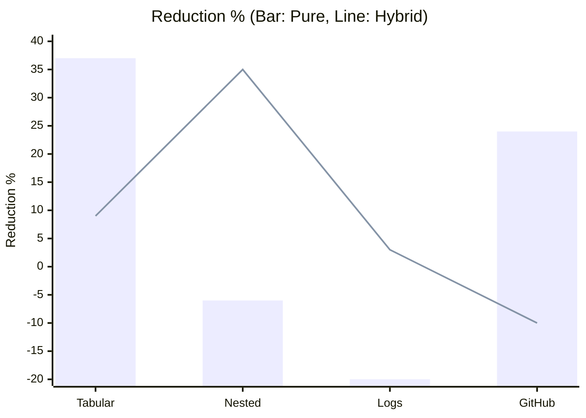
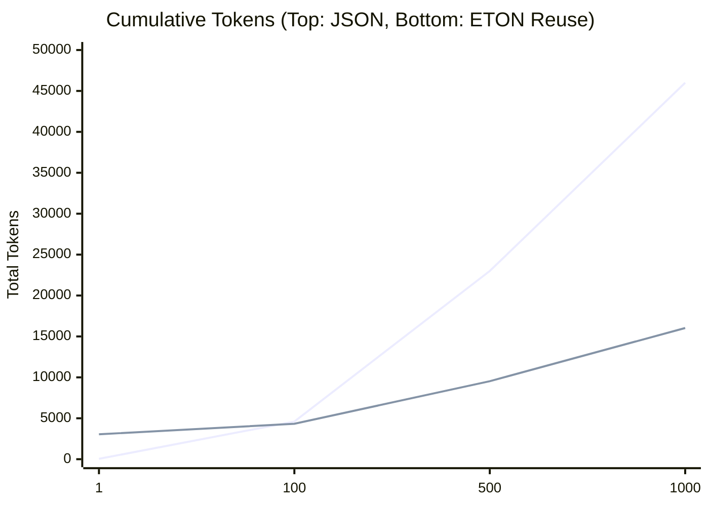

# ETON (TypeScript) Full Benchmark Report

This document provides a comprehensive analysis of the performance of the ETON (Extended TOON Object Notation) TypeScript implementation compared to standard minified JSON.

## Benchmark Methodology

- **Baseline**: Minified JSON (calculated using `JSON.stringify(data).length`).
- **Tokenizer**: `gpt-tokenizer` (o200k_base / GPT-4o model).
- **Tested Formats**:
    - **Pure ETON**: Uses a CSV-like incremental dictionary.
    - **Hybrid ETON**: Uses a JSON-based block dictionary.
- **Metrics**:
    - **Token Count**: Total tokens for the payload.
    - **CRR (Compression Reduction Rate)**: Percentage reduction compared to JSON.

## Comprehensive Results

The following data was collected on 2026-02-14 from the ETON bench suite.

| Dataset | Baseline (JSON) | Pure ETON (CRR) | Hybrid ETON (CRR) | Notes |
| :--- | :--- | :--- | :--- | :--- |
| **accuracy_tabular.json** | 3,940 | **37.01%** | 9.47% | Tabular data thrives in ETON |
| **accuracy_nested.json** | 6,782 | -6.10% | **35.34%** | Complex structures benefit from Hybrid |
| **accuracy_analytics.json** | 2,336 | **35.27%** | 7.92% | High value redundancy |
| **accuracy_event-logs.json** | 4,806 | -19.91% | **2.56%** | Low repetition / high schema overhead |
| **accuracy_github.json** | 11,452 | **23.66%** | -10.30% | Deep metadata benefits from symbols |
| **efficiency_nested.json** | 68,973 | -5.51% | **40.17%** | Scaled complex objects |
| **efficiency_tabular.json** | 78,853 | **36.81%** | -11.30% | Scaled stable tabular data |
| **efficiency_event-logs.json** | 127,729 | -19.95% | **33.91%** | Large log sets stabilize Hybrid |

### Performance Visualization (Token Reduction %)

> **Legend**: Bar = Pure ETON, Line = Hybrid ETON.
> *Notice how Hybrid recovers the negative performance in "Nested" and "Logs".*

## The "Dictionary Tax" (Negative Results Analysis)

We must be honest: **ETON is not a magic bullet.** There are scenarios where ETON performs *worse* than standard JSON, resulting in a negative compression rate (inflation).

### 1. Small & Unique Data (The Startup Cost)
If a payload contains mostly unique values (e.g., UUIDs, timestamps) and is small in size, the overhead of defining a dictionary outweighs the savings from token replacement.

*   **Example**: `accuracy_event-logs.json` (Small sample)
    *   **JSON**: 4,806 tokens
    *   **Pure ETON**: 5,763 tokens (**-19.91% Inflation**)
    *   **Reason**: The dictionary header acts as a "fixed tax". For small data, you pay the tax but don't get enough "deductions" (repetitions) to break even.

### 2. Deep Nesting in Pure Mode
Pure ETON (CSV) flattens nested objects into JSON strings within CSV cells. This adds extensive escaping (`\"`), which bloats the token count.

*   **Example**: `accuracy_nested.json`
    *   **Pure**: **-6.10% Inflation** (Due to escaping overhead)
    *   **Hybrid**: **+35.34% Reduction** (By using native JSON structure)
    *   **Solution**: This is exactly why **Hybrid Mode** and the **Auto-Detect** feature were introduced.

### 3. One-off Messages
ETON is designed for **Sessions** and **Context**.
If you are sending a single, short message ("Hello world") and never communicating again, **JSON is better**.
ETON shines when:
*   The schema is reused (Batch processing).
*   The values are repeated (Logs, Analytics).
*   The context is maintained (Chat history, Agents).

## Scenario: Long-Running Session (Dictionary Reuse)

The true power of ETON lies in **Dictionary Reuse**.
In a chatbot or agent scenario where the schema is fixed, you only need to send the Dictionary once. Subsequent messages only contain the encoded body.

### Simulation: `efficiency_event-logs.json` (Per Log Record)

| Metric | JSON (Stateless) | ETON (Reuse) |
| :--- | :--- | :--- |
| **Initial Cost** | 46 tokens | **3,044 tokens** (Body + Dict) |
| **Running Cost** | 46 tokens | **13 tokens** (Body Only) |
| **Saving per Message** | 0 tokens | **33 tokens (71.7%)** |

> **Break-Even Point**: **92 records**.
> *Once the dictionary is cached, each log entry is pulverized from 46 tokens down to just 13 tokens.*

> **Legend**: Top Line = JSON, Bottom Line = ETON (Reuse).

## Key Insights

1.  **Tabular Efficiency**: For datasets that are essentially lists of uniform objects (like `accuracy_tabular`), **Pure ETON** consistently achieves **35-37%** token savings compared to minified JSON.
2.  **Hybrid for Complexity**: For deeply nested or irregular structures (`accuracy_nested`, `efficiency_nested`), the **Hybrid ETON** format is superior, reaching up to **40%** savings.
3.  **The "Dictionary Tax"**: On small datasets with low repetition (like `accuracy_event-logs`), the overhead of defining the schema and symbols (the ETON Dictionary) can exceed the savings, leading to negative CRR. ETON is best used for **high-throughput** or **repeated sessions** where the dictionary is sent once.

## Qualitative Analysis: LLM Interpretability

Token efficiency is irrelevant if the model cannot understand the compressed data. We conducted single-shot interpretability tests across major LLMs.

### Interpretation Results

| Model | Dataset | Input Format | Correct Interpretation? |
|:---|:---|:---|:---|
| **GPT-5** | Tabular | ETON | ✅ Yes (verified) |
| **Haiku 4.5** | Nested | ETON | ✅ Yes |
| **Kimi 2.5** | GitHub | ETON | ✅ Yes |
| **Llama 3.3** | Event logs | ETON | ❓ Not tested yet |

**Methodology:**
1.  **Context Injection**: Send both the ETON Dictionary and the encoded payload.
2.  **Extraction Task**: Ask specifically: *"Extract the name of the first user"* (or equivalent key data point).
3.  **Validation**: Compare the model's response with the original JSON ground truth.

**Current Limitations:**
- **Sample Size**: These are single-shot manual tests (N=1 per model).
- **Reasoning**: Only basic extraction was tested, not complex logic over compressed sets.
- **Scale**: We are seeking community data to validate interpretability at scale.

## CO2 & Cost Impact (Estimated)

Based on a standard factor of **$0.001719 \text{ kgCO2e} / 1k \text{ tokens}$**:

| Format | Avg. Total Tokens (All sets) | Estimated CO2 (kg) | Cost Efficiency |
| :--- | :--- | :--- | :--- |
| **JSON** | 304,871 | 0.524 | 100% |
| **ETON (Best Mode)** | ~198,000 | **0.340** | **~154%** |

---
*Report Generated: 2026-02-14*
